# End_to_end_data_pipeline---Optimizing_Online_Retail_Analytics_with_Data_and_Analytics_Engineering

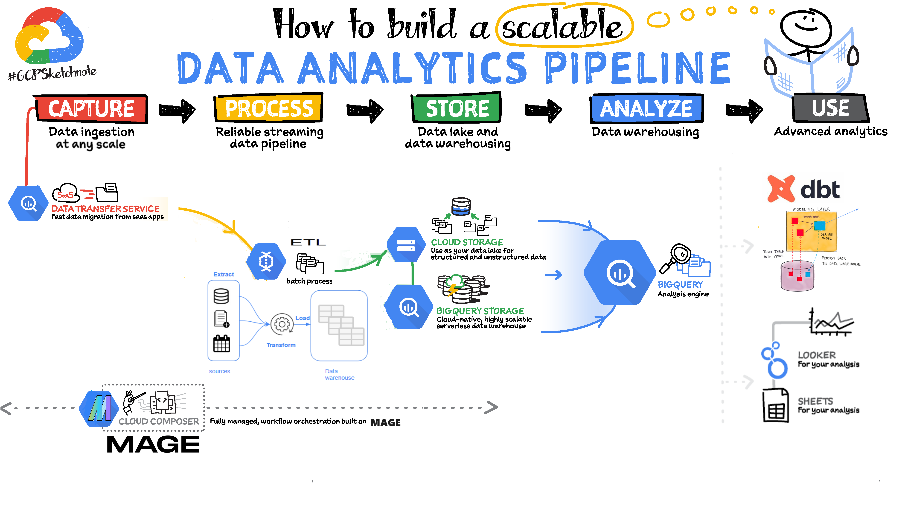

# Problem statement


# TECHNOLOGIES

* **Cloud**: GCP
* **Infrastructure as code (IaC)**: Terraform, Google Cloud Run, Cloud Build
* **Workflow orchestration**: Mage
* **Data Warehouse**: BigQuery
* **Dashboard**: Looker Studio

## PROJECT STRUCTURE
```
.
├── README.md
├── (CI.CD)-Continous-Intergration-and-Deployment
│   └── cloudbuild.yaml
├── Looker_studio_Dashboard
├── data
│   ├── Online Retail.xlsx
│   └── README.md
├── dbt-Analytics_Engineering(Data Build Tool)
│   ├── README.md
│   ├── analyses
│   ├── dbt_project.yml
│   ├── macros
│   ├── models
│   │   ├── core
│   │   │   ├── fact_online_retail_data_partitioned_clustered.sql
│   │   │   └── fact_online_retail_data_unpartitioned.sql
│   │   └── staging
│   │       ├── schema.yml
│   │       └── stg_online_retail_data.sql
│   ├── package-lock.yml
│   ├── packages.yml
│   ├── seeds
│   ├── snapshots
│   └── tests
├── images
│   ├── data_analytics_pipeline.png
│   ├── data_analytics_pipeline.png:Zone.Identifier
│   ├── dbt_deploy_job_12hrs.png
│   ├── dbt_lineage_graph_DAG.png
│   ├── dbt_project_overview.png
│   ├── fact_online_retail_data_partitioned_clustered.png
│   ├── fact_online_retail_data_unpartitioned.png
│   ├── loading_from_api_transformations_to_gcs_partitioned.png
│   ├── loading_from_google_cloud_storage_to_bigquery_table.png
│   ├── pipelines_in_mage.png
│   ├── stg_online_retail_data.png
│   └── trigger_for_mage.png
├── mage-ai-Terraform-Infrastructure-As-Code
│   ├── README.md
│   ├── db.tf
│   ├── direct-disk-412820-2333e42872f1.json
│   ├── fs.tf
│   ├── load_balancer.tf
│   ├── main.tf
│   ├── terraform.tfstate
│   ├── terraform.tfstate.backup
│   └── variables.tf
└── mage-ai-Workflow-Orchestration
    ├── Dockerfile
    ├── README.md
    ├── direct-disk-412820-2333e42872f1.json
    ├── docker-compose.yml
    ├── mage_data
    │   └── magic-zoomcamp
    │       ├── mage-ai.db
    │       └── pipelines
    │           ├── example_pipeline
    │           ├── gcs_to_bigquery
    │           ├── loading_from_api_transformations_to_gcs_partitioned
    │           ├── loading_from_google_cloud_storage_to_bigquery_table
    │           ├── online_retail_data_loading_api_processing_to_gcs_partitioned
    │           ├── spirited_familiar
    │           └── spirited_hill
    ├── magic-zoomcamp
    │   ├── __init__.py
    │   ├── charts
    │   │   ├── __init__.py
    │   ├── custom
    │   │   ├── __init__.py
    │   ├── data_exporters
    │   │   ├── __init__.py
    │   │   ├── export_data_to_google_bigquery.py
    │   │   └── export_data_to_google_cloud_stoage_partitioned.py
    │   ├── data_loaders
    │   │   ├── __init__.py
    │   │   ├── daring_ancient.py
    │   │   ├── enigmatic_sky.py
    │   │   ├── load_data_from_api.py
    │   │   ├── load_data_from_google_cloud_storage.py
    │   │   ├── load_titanic.py
    │   │   ├── moonlit_water.py
    │   │   ├── polished_realm.py
    │   │   ├── refined_spellcaster.py
    │   │   ├── relaxed_monk.sql
    │   │   ├── timeless_sunrise.py
    │   │   └── utopian_ancient.py
    │   ├── dbt
    │   │   └── profiles.yml
    │   ├── dbts
    │   │   ├── __init__.py
    │   │   ├── humble_ancient.yaml
    │   │   ├── humble_sword.yaml
    │   │   └── mindful_silversmith.yaml
    │   ├── extensions
    │   │   ├── __init__.py
    │   ├── interactions
    │   │   ├── __init__.py
    │   ├── io_config.yaml
    │   ├── metadata.yaml
    │   ├── pipelines
    │   │   ├── __init__.py
    │   │   ├── loading_from_api_transformations_to_gcs_partitioned
    │   │   │   ├── __init__.py
    │   │   │   └── metadata.yaml
    │   │   └── loading_from_google_cloud_storage_to_bigquery_table
    │   │       ├── __init__.py
    │   │       └── metadata.yaml
    │   ├── requirements.txt
    │   ├── scratchpads
    │   │   ├── __init__.py
    │   ├── transformers
    │   │   ├── __init__.py
    │   │   └── transform_and_clean_api_data.py
    │   └── utils
    │       ├── __init__.py
    └── requirements.txt
```


## DATASET**:
Choose datasets that are suitable for building a data pipeline and dashboard. Look for datasets with sufficient volume, variety, and relevance to demonstrate your skills.

#### Files and Directories
```
├── data
│   ├── Online Retail.xlsx
│   └── README.md
```

A well-known dataset is the "Online Retail" dataset from the UCI Machine Learning Repository. This dataset contains transactional data from an online retail platform and is suitable for analyzing sales trends, customer behavior, and product performance.

Here are some details about the "Online Retail" dataset:

- **Source**: UCI Machine Learning Repository
- **Description**: This dataset contains transactional data from an online retail store based in the United Kingdom. The data includes customer information, product details, invoice numbers, transaction dates, and sales quantities. It covers transactions that occurred between 01/12/2010 and 09/12/2011.
- **Features**: The dataset includes attributes such as InvoiceNo, StockCode, Description, Quantity, InvoiceDate, UnitPrice, CustomerID, and Country.
- **Format**: The dataset is typically provided in a CSV (Comma Separated Values) format.
- **Size**: The dataset is relatively small, with around 500,000 records.

You can find the "Online Retail" dataset on the UCI Machine Learning Repository website. Here is the direct link: [Online Retail Dataset](https://archive.ics.uci.edu/ml/datasets/online+retail).

This dataset is popular among data scientists and analysts for exploring eCommerce sales data, performing market basket analysis, and building recommendation systems. It's a great choice for your data engineering project as it provides rich transactional data that can be used for various analyses and insights.


# **INFRASTRUCTURE AS CODE (IaC)**:
   - Use Infrastructure as Code (IaC) tools like Terraform to provision cloud resources.

#### Terraform
[Terraform](https://www.terraform.io/) is an open-source infrastructure as code software tool created by HashiCorp. It allows users to define and provision data center infrastructure using a high-level configuration language known as HashiCorp Configuration Language (HCL).

#### Files and Directories
```
├── mage-ai-Terraform-Infrastructure-As-Code
│   ├── README.md
│   ├── db.tf
│   ├── fs.tf
│   ├── load_balancer.tf
│   ├── main.tf
│   └── variables.tf
```


#### Usage
1. **Installation**: Ensure Terraform is installed on your local machine.
2. **Configuration**: Modify the `.tf` files to match your desired infrastructure configuration.
3. **Initialization**: Run `terraform init` to initialize the working directory containing Terraform configuration files.
4. **Planning**: Run `terraform plan` to create an execution plan. This step is optional but recommended to verify changes before applying them.
5. **Execution**: Run `terraform apply` to apply the changes required to reach the desired state of the configuration.
6. **Verification**: After applying changes, verify that the infrastructure has been provisioned correctly.
7. **Cleanup**: When done, run `terraform destroy` to destroy all the resources defined in the Terraform configuration.


# **DESIGN THE DATA PIPELINE**:
   - Decide whether to implement a batch  pipeline based on your preferences and the nature of the data.
   - Choose appropriate cloud services and infrastructure tools for data storage, processing, and orchestration.
   - Define the steps for data ingestion, transformation, loading into data lakes and data warehouses, and dashboard creation.


* Creating a pipeline for processing this dataset and putting it to a datalake
* Creating a pipeline for moving the data from the lake to a data warehouse

pipelines
1. loading_from_google_cloud_storage_to_bigquery_table

data loader
load_data_from_api

transformer
transform_and_clean_api_data

data_exporter
export_data_to_google_cloud_stoage_partitioned

2. loading_from_api_transformations_to_gcs_partitioned

data loader
load_data_from_google_cloud_storage.py

data exporter
export_data_to_google_bigquery.py

trigger for mage

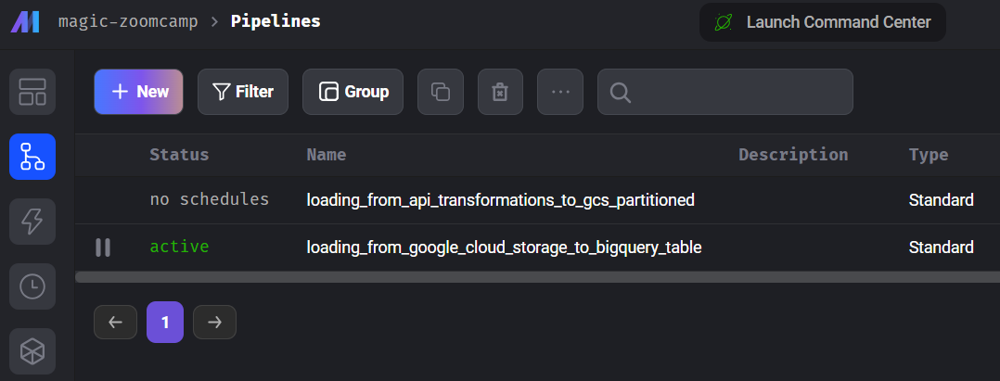


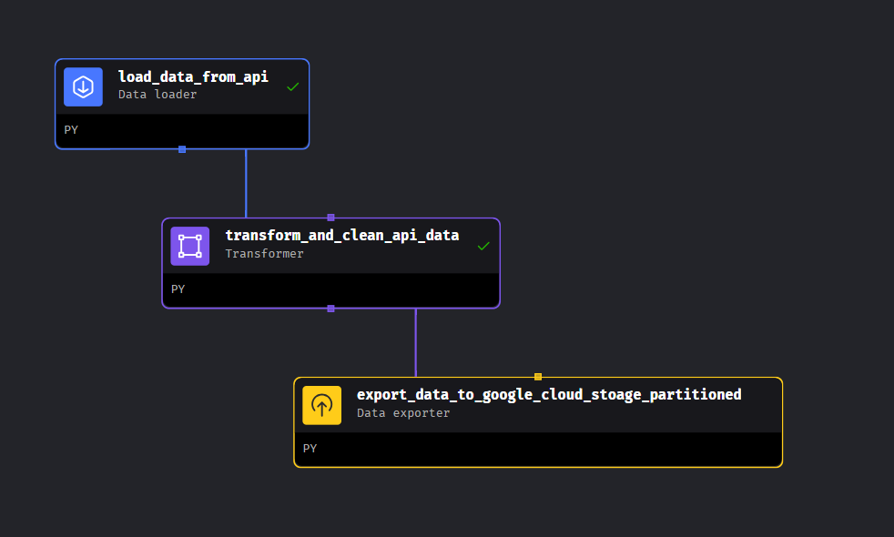

#### Files and Directories
```
└── mage-ai-Workflow-Orchestration
    ├── magic-zoomcamp
        ├── pipelines
        │   └── loading_from_api_transformations_to_gcs_partitioned
        ├── data_loaders
        │   └── load_data_from_api.py
        ├── transformers
        |   └── transform_and_clean_api_data.py
        └── data_exporters
            └── export_data_to_google_cloud_stoage_partitioned.py
```


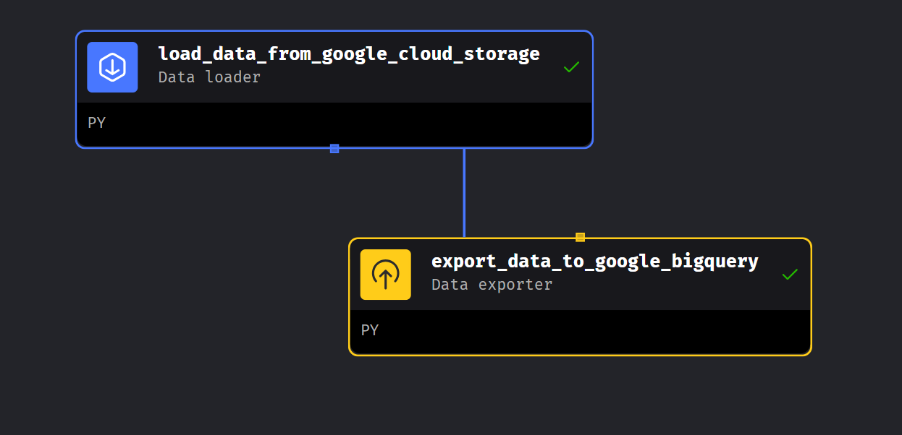

#### Files and Directories
```
└── mage-ai-Workflow-Orchestration
    ├── magic-zoomcamp
        ├── pipelines
        │   └── loading_from_google_cloud_storage_to_bigquery_table
        ├── data_loaders
        │   └── load_data_from_google_cloud_storage.py
        └─ data_exporters
            └── export_data_to_google_bigquery.py
```

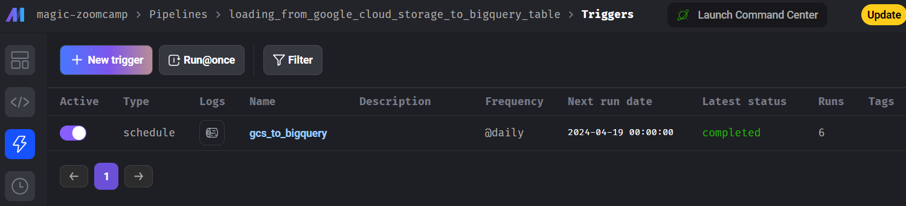

* **Batch**: If you want to run things periodically (/daily) in mage


5. **Implement Data Pipelines**:
   - Implement workflow orchestration using tools such as Mage to Develop batch processing and managing pipeline execution.


6. **PERFORM DATA TRANSFORMATIONS**:
   - Apply transformations using dedicated data transformation tools like dbt to prepare data for analytics.
   - Ensure data quality and consistency through validation and cleansing processes.
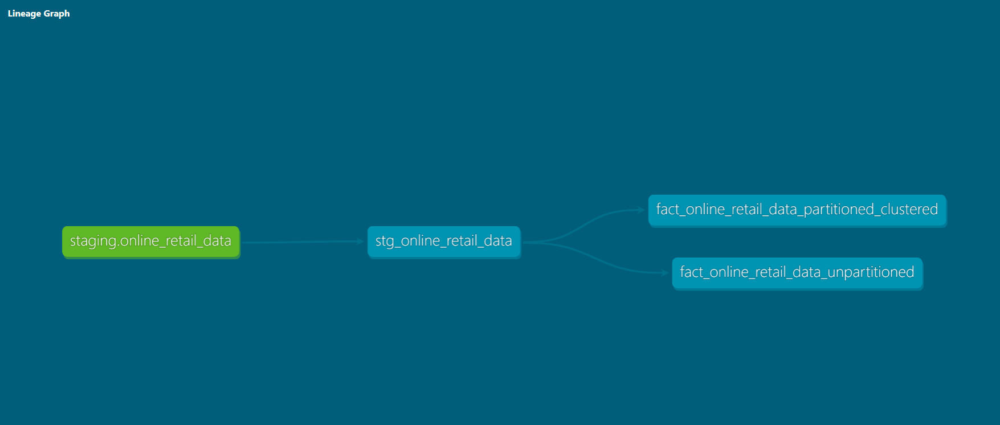
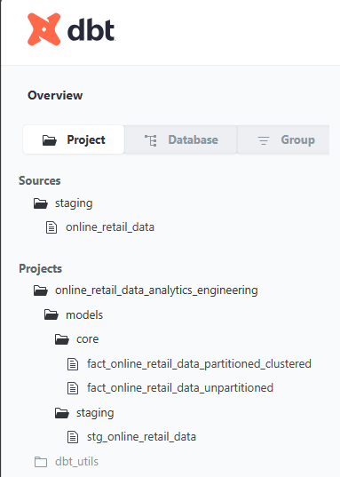

* Transforming the data in the data warehouse: prepare it for the dashboard


#### Files and Directories

```
├── dbt-Analytics_Engineering(Data Build Tool)
│   ├── dbt_project.yml
│   └── models
│       ├── core
│       │   ├── fact_online_retail_data_partitioned_clustered.sql
│       │   └── fact_online_retail_data_unpartitioned.sql
│       └── staging
│           ├── schema.yml
│           └── stg_online_retail_data.sql
```

```
│       │   ├── fact_online_retail_data_partitioned_clustered.sql
```
Tables are partitioned and clustered in a way that makes sense for the upstream queries (with explanation)

dbt documentation

documentation link = https://cloud.getdbt.com/accounts/246257/jobs/576492/docs/#!/overviewhttps://cloud.getdbt.com/accounts/246257/jobs/576492/docs/#!/overview


lineage graph


link for each model scripts

source
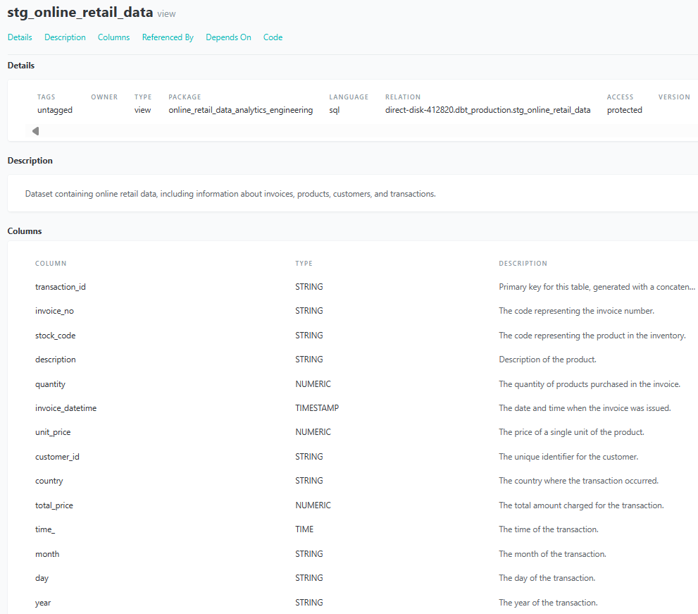

staging


core - fact tables

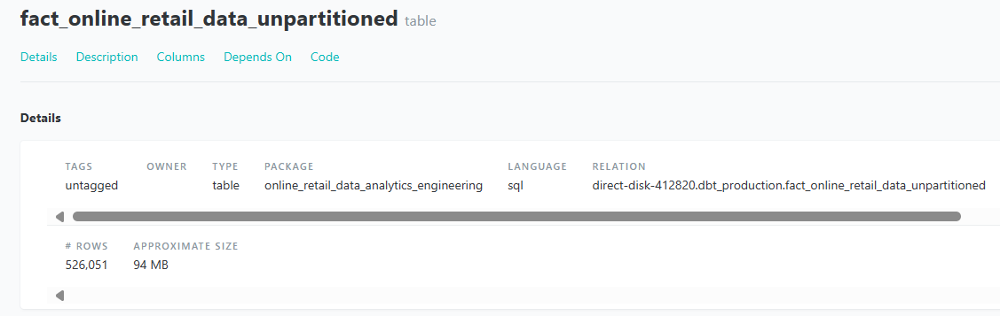

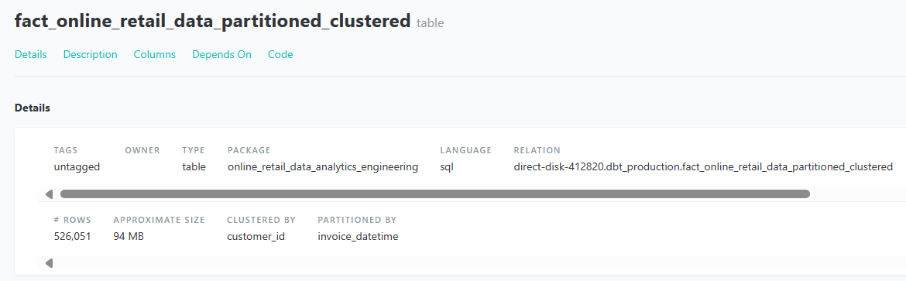
partitioned by 'invoice_datetime' and clustered by 'customer_id'


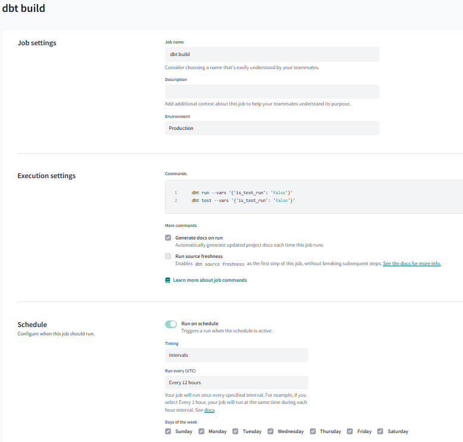

8. **DOCUMENTATION AND TESTING**:
   - Document the project setup, data pipeline architecture, and dashboard components in a README file.

#### Files and Directories
```
├── dbt-Analytics_Engineering(Data Build Tool)
│   ├── dbt_project.yml
│   ├── models
│   │   └── staging
│   │       └── schema.yml
│   └── tests
```

# **BUILD THE DASHBOARD**:
   - Choose a BI tool such as Data Studio for creating the dashboard.
   - Design intuitive visualizations that provide insights into the processed data.

* Building a dashboard to visualize the data


#### Files and Directories

- 1 graph that shows the distribution of some categorical data
- 1 graph that shows the distribution of the data across a temporal line


```
├── Looker_studio_Dashboard
```


# (CI/CD)-CONTINOUS-INTERGRATION-AND-DEPLOYMENT

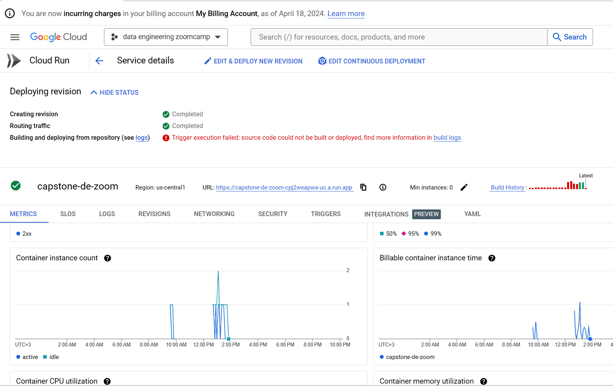

#### Files and Directories
```
├── (CI.CD)-Continous-Intergration-and-Deployment
│   └── cloudbuild.yaml
```


